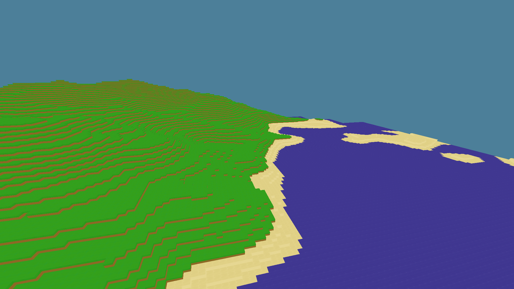

# opengl-minecraft
This is an older project made before my use of git, and as such the git history is unfortunately non-existant

The project was initially intended to include more features, such as world manipulation and chunks that actually had any amount of depth beyond one block. However, because of a lack of knowledge about linear algebra, I decided to cut it short and maybe recreate it later when I had taken university math classes.

## Features
* 3D rendered blocks using opengl
* Chunk based world generation using Perlin noise
* 3 differnet blocks types for different distances from sea level
* Moveable Camera

## Screenshot

## Dependencies
opengl is used for the 3D rendering, and SFML is used for actually drawing the display. Additionally, noiseutils is used for Perlin noise sound generation and glm is used for 3d math